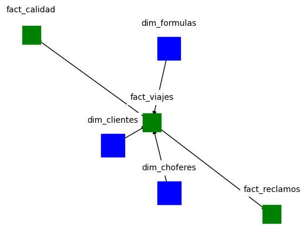

# Concrete Mixer Production Simulation

## Project Overview

This project addresses the lack of datasets pertaining to the production metrics of concrete mixers. To bridge this gap, a comprehensive simulation of multiple years of concrete mixer production was conducted. The simulation encompasses a variety of production factors and aims to mimic real-world data closely. 
The resulting data conformed a star schema as can be seing in the next figure.

## Simulation Details

The simulation was crafted to represent realistic scenarios in concrete mixer production, factoring in variables such as production volume, claims, and quality control. The resulting dataset provides a rich source of information for analysis and decision-making.
The way I handled the concrete production was to assume it was tied to the amount of mixer drivers available, with each driver having their unique efficiency. In this way, whenever the company add another driver, the overall production went up in an amount equal to the daily batches this new driver dispatches. Also, I have selected months where the production was lower (simulating climate conditions that affect the ability to dispatch).

## Dashboard

The Streamlit dashboard provides an interactive interface for users to explore the simulated data. It features various visualizations that offer insights into production trends, efficiency, and potential areas for improvement. You would be able to find it in [here](https://concrete-dashboard.streamlit.app/).

